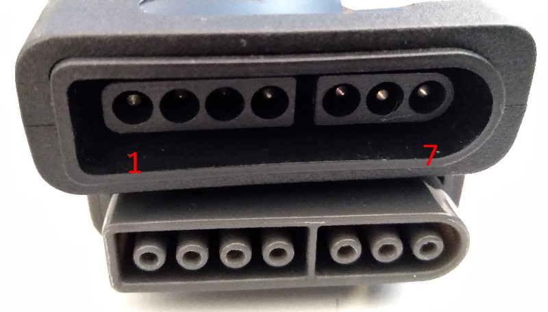
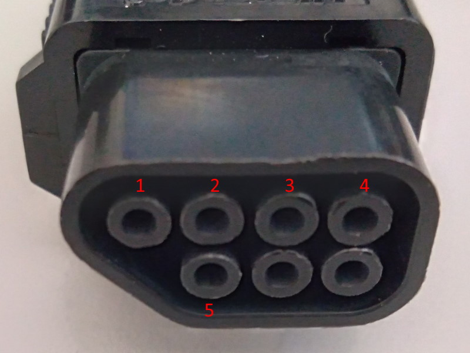
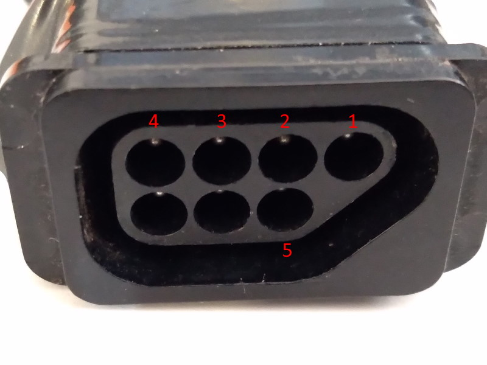

# SnesLib
Super Nintendo (SNES) input library for Arduino with multitap compatibility

For Arduino Leonard/Pro Micro (5V 16MHz)

## Controller compatibility

It's been tested and confirmed to work with:

| Accessory        | Notes                                    |
|------------------|------------------------------------------|
| SNES Digital Pad |                                          |
| 8bitdo SN30 2.4G | If on multitap, only works on first port |
| NTT Data Pad     |                                          |
| Super Multitap   | Only detected during boot                |
| Naki Tribal Tap  | Only detected during boot                |
| NES Digital Pad  | Requires simple adapter                  |

## How to use
Snes controllers works with 5V so I recommend to use a 5V Arduino.

This library requires [DigitalIO](https://github.com/greiman/DigitalIO).

I recommend the usage of [SukkoPera's fork of DigitalIO](https://github.com/SukkoPera/DigitalIO) as it supports a few more platforms.

Sample sketches requires uses [ArduinoJoystickLibrary](https://github.com/MHeironimus/ArduinoJoystickLibrary).

Install the library on your Arduino library folder. Also install the required dependencies.

Then open any of the provided [sketches](sketches).

### Snes port pins

| 1 2 3 4 | 5 6 7 )

| Snes | Description | Arduino |
|------|-------------|---------|
| 1    | VCC/POWER   | 5V      |
| 2    | CLOCK       | A3      |
| 3    | LATCH       | A2      |
| 4    | DATA1       | A1      |
| 5    | DATA2       | A0      |
| 6    | SELECT      | 14      |
| 7    | GROUND      | GND     |

DATA2 and SELECT are only required for multitap use.

### Nes port pins

| Nes | Description | Arduino |
|-----|-------------|---------|
| 1   | GROUND      | GND     |
| 2   | CLOCK       | A3      |
| 3   | LATCH       | A2      |
| 4   | DATA1       | A1      |
| 5   | VCC/POWER   | 5V      |

#### Snes button mapping

| Snes   | HID | PS3     |
|--------|-----|---------|
| D-PAD  | HAT | D-PAD   |
| B      | 1   | X       |
| A      | 2   | O       |
| Y      | 0   | &#9723; |
| X      | 3   | &#9651; |
| L      | 4   | L1      |
| R      | 5   | R1      |
| Select | 8   | Select  |
| Start  | 9   | Start   |

#### Nes button mapping

| Snes   | HID | PS3     |
|--------|-----|---------|
| D-PAD  | HAT | D-PAD   |
| B      | 1   | X       |
| A      | 2   | O       |
| Select | 8   | Select  |
| Start  | 9   | Start   |

## Credits

My friend Rafael for lending me the multitap and the nes adapter.

NOCASH's [fullsnes](http://problemkaputt.de/fullsnes.htm) docs.

Darthcloud's [Blue Retro](https://hackaday.io/project/170365-blueretro/log/181686-2020-08-04-progress-update-sfcsnes-support) docs

It uses the [DigitalIO](https://github.com/greiman/DigitalIO) from greiman.

I recommend the usage of [SukkoPera's fork of DigitalIO](https://github.com/SukkoPera/DigitalIO) as it supports a few more platforms.

Initial Snes controller reading was based on [Snes Library](https://github.com/turicas/SNES) by turicas, but almost rewritten from scratch to support multitap.

## Warning
Code and wiring directions are provided to you 'as is' and without any warranties. Use at your own risk.

